# Документация к проекту управления светофором
## Оглавление
- [Общее описание](#общее-описание)
- [Ключевые компоненты](#ключевые-компоненты)
- [Логика работы](#логика-работы)
    - [Автоматический режим (MODE_AUTO)](#автоматический-режим-mode_auto)
    - [Ручной режим (MODE_MNT)](#ручной-режим-mode_mnt)
- [Глобальные переменные](#глобальные-переменные)
- [Основные функции](#основные-функции)
- [Схема подключения](#схема-подключения)
- [Требования к компонентам](#требования-к-компонентам)
- [Примечания по подключению](#примечания-по-подключению)
- [Особенности работы](#особенности-работы)
### Общее описание

Данный проект реализует систему управления светофором на базе STM32 с двумя режимами работы:

- **Автоматический режим (MODE_AUTO):** цикл светофора выполняется автоматически.
- **Ручной режим (MODE_MNT):** переход между фазами осуществляется по нажатию кнопки.

Работа проводилась на плате Blue Pill+  на базе STM32F103CB
---

### Ключевые компоненты

- **Светодиоды светофора (порт GPIOA):**
    - PA0 — красный
    - PA1 — желтый
    - PA2 — синий/зеленый

- **Индикатор режима (порт GPIOB):**
    - PB2 — статус работы системы

- **Кнопки управления:**
    - GPIO_PIN_3 — переключение в автоматический режим
    - GPIO_PIN_4 — переключение в ручной режим и подтверждение действия

---

### Логика работы

#### Автоматический режим (MODE_AUTO):

1. Красный — 2 сек
2. Желтый — 2 сек
3. Синий — 2 сек
4. Мигание синего — 4 раза по 300 мс
5. Цикл повторяется

#### Ручной режим (MODE_MNT):

1. Включен красный свет
2. Ожидание нажатия кнопки (GPIO_PIN_4)
3. После нажатия:
     - Красный выключается
     - Желтый — 2 сек
     - Синий — 2 сек
     - Мигание синего — 4 раза
     - Возврат к шагу 1

---

### Глобальные переменные

- `currentMode` — текущий режим работы (MODE_AUTO/MODE_MNT)
- `flag` — флаг управления циклом светофора
- `pinUp` — флаг нажатия кнопки в ручном режиме
- `lastDebounceTime` — время последнего нажатия
- `debounceDelay` — задержка для подавления дребезга (обычно 50-200 мс)

---

### Основные функции

- `resetTrafficLightState()` — сбрасывает все светодиоды и флаг нажатия кнопки
- `setupTrafficLightMNT()` — логика ручного режима, ожидание нажатия кнопки
- `setupTrafficLightAUTO()` — автоматический цикл светофора
- `setupMode()` — главный управляющий цикл, переключение режимов, управление индикатором
- `HAL_GPIO_EXTI_Callback()` — обработчик прерываний от кнопок, защита от дребезга, переключение режимов

---

### Схема подключения

| Компонент           | Порт STM32 | Пиновое подключение |
|---------------------|------------|---------------------|
| Красный светодиод   | GPIOA      | PA0                 |
| Желтый светодиод    | GPIOA      | PA1                 |
| Синий светодиод     | GPIOA      | PA2                 |
| Индикатор режима    | GPIOB      | PB2                 |
| Кнопка AUTO         | GPIOC      | PC3                 |
| Кнопка MANUAL       | GPIOC      | PC4                 |

---

### Требования к компонентам

- **Светодиоды:**
    - Тип: 3–5 мм
    - Напряжение: 3.3 В
    - Ток: 15–20 мА

- **Резисторы:**
    - Номинал: 220 Ом
    - Мощность: 0.25 Вт

- **Кнопки:**
    - Тактовые, нормально разомкнутые
    - Рабочее напряжение: 3.3 В

---
### Схема подключения

---
### Примечания по подключению

- Для всех светодиодов обязательно использование токоограничивающих резисторов.
- Кнопки подключаются:
    - Один контакт — на землю (GND)
    - Второй контакт — на соответствующий пин MCU
- В коде должны быть настроены подтягивающие резисторы для кнопок (`GPIO_PULLUP` в HAL).
- Для работы прерываний требуется правильная настройка EXTI в HAL.

---

### Особенности работы

- В ручном режиме индикатор режима (PB2) мигает с частотой 2 Гц.
- В автоматическом режиме индикатор горит постоянно.
- Защита от дребезга реализована программно (задержка 10 мс).
- Переключение режимов происходит мгновенно при нажатии кнопок.
Номинал: 220 Ом
